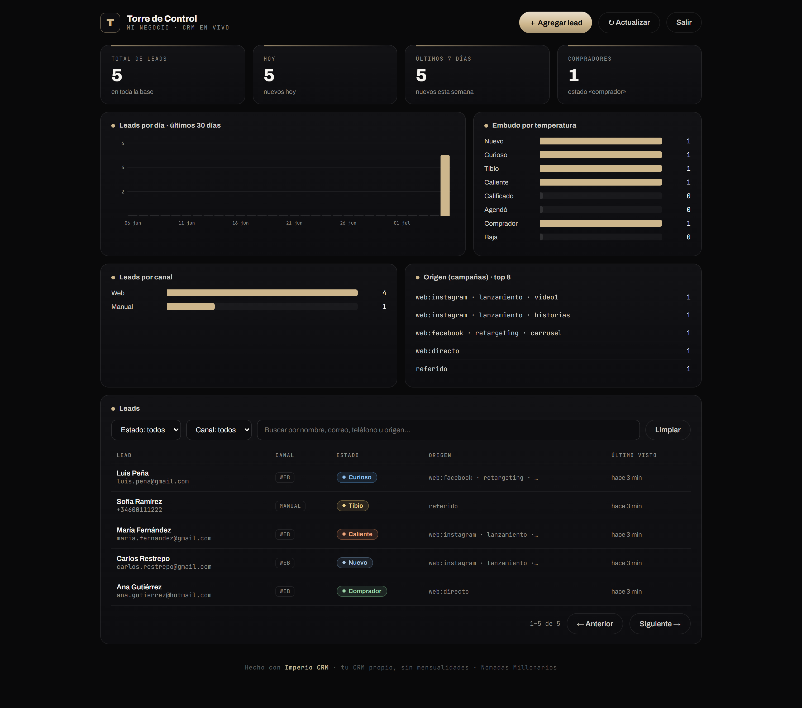

# 👑 Imperio CRM

**Tu CRM propio, gratis para siempre, en tu propia cuenta de Cloudflare.**

Deja de pagarle mensualidad a un CRM. Este es el mismo CRM que usamos en [Imperio](https://www.instagram.com/soydiegoosorio): captura los leads de tu landing, te muestra todo en una Torre de Control visual, y vive en TU cuenta — tus datos son tuyos y nadie te puede subir el precio.



## Qué incluye

- 📥 **Captura de leads** desde cualquier landing o formulario (`POST /lead`), con atribución UTM: sabrás qué anuncio trajo a cada persona.
- 🗼 **Torre de Control**: panel visual con leads por día, embudo por temperatura (nuevo → curioso → tibio → caliente → calificado → agendó → comprador), canales y campañas.
- ✍️ **Gestión manual**: agrega leads a mano, cambia su estado, guarda notas de cada uno.
- 🔐 **Tu clave, tus datos**: la primera vez que abres la Torre creas tu clave. Nadie más entra.
- 🎨 **Tu marca**: pon el nombre de tu negocio y tu color en 2 líneas de configuración — el panel entero se viste solo.
- 💸 **Costo: $0/mes.** El plan gratis de Cloudflare aguanta 100.000 visitas al día. A un negocio que arranca le sobra por años. Ni tarjeta de crédito piden.

## Instalación

> Solo necesitas una cuenta gratis de Cloudflare: [dash.cloudflare.com/sign-up](https://dash.cloudflare.com/sign-up) (2 minutos, sin tarjeta).

### Opción 1 · El botón mágico (un clic)

[](https://deploy.workers.cloudflare.com/?url=https://github.com/diegodoc11/imperio-crm)

1. Haz clic en el botón y conecta tu cuenta de Cloudflare (y GitHub).
2. Cloudflare crea tu copia del CRM **con tu propia base de datos** — todo solo.
3. Al terminar, abre `https://imperio-crm.TU-SUBDOMINIO.workers.dev/torre` y **crea tu clave de acceso**.

Listo. Ya tienes CRM propio.

### Opción 2 · Con Claude, tu mano derecha (el método Imperio)

Abre Claude Code y pégale el mensaje que está en [`INSTALA-CON-CLAUDE.md`](INSTALA-CON-CLAUDE.md). Claude descarga el CRM, lo conecta a tu cuenta, le pone el nombre y el color de TU negocio, lo despliega y lo prueba contigo. Así trabajamos en Imperio: tú das la orden, la IA ejecuta.

### Opción 3 · A mano (terminal)

```bash
git clone https://github.com/diegodoc11/imperio-crm.git
cd imperio-crm
npm install
npx wrangler login                        # conecta tu cuenta de Cloudflare
npx wrangler d1 create imperio-crm-db     # crea tu base de datos
# 👉 pega el database_id que te devuelve en wrangler.jsonc
# 👉 pon tu negocio, color y zona horaria en las "vars" de wrangler.jsonc
npx wrangler deploy
```

Abre la URL que te da (termina en `.workers.dev`), entra a `/torre` y crea tu clave.

## Conecta tu landing

Tu CRM recibe leads con un simple `POST /lead`:

```js
fetch('https://TU-CRM.workers.dev/lead', {
  method: 'POST',
  headers: { 'content-type': 'application/json' },
  body: JSON.stringify({
    channel: 'web',
    name: 'Nombre del lead',
    email: 'correo@ejemplo.com',
    phone: '+573001234567',
    source: 'web:instagram · campaña · anuncio'   // ¿de dónde vino?
  })
})
```

En [`ejemplos/formulario.html`](ejemplos/formulario.html) hay un formulario completo listo para usar: captura nombre/correo/WhatsApp y guarda solo de qué anuncio vino cada lead (UTM de primer toque). Cámbiale la URL, pégalo en tu landing y ya.

## Personalízalo (sin tocar código)

En `wrangler.jsonc`, sección `vars`:

| Variable | Qué hace | Ejemplo |
|---|---|---|
| `BUSINESS_NAME` | El nombre que ves en la Torre | `"Barbería El Patrón"` |
| `BRAND_COLOR` | El color de todo el panel (hex) | `"#5da2e8"` |
| `TIMEZONE` | Tu zona horaria (para que "hoy" sea tu hoy) | `"America/Mexico_City"` |

Cambias, corres `npx wrangler deploy`, y la Torre se re-viste sola.

## Preguntas frecuentes

**¿De verdad es gratis?** Sí. Workers gratis: 100.000 visitas/día. Base de datos D1 gratis: 5 millones de lecturas/día. Para un CRM personal, eso es prácticamente infinito.

**¿Se me olvidó la clave, qué hago?** Corre esto y vuelve a entrar a `/torre` para crear una nueva:
```bash
npx wrangler d1 execute imperio-crm-db --remote --command "DELETE FROM config WHERE key IN ('torre_key_hash','torre_key_salt')"
```

**¿Cómo lo actualizo cuando salga versión nueva?** Pídele a Claude: *"actualiza mi Imperio CRM con la última versión del repo"*. O a mano: `git pull` + `npx wrangler deploy`. Tus leads no se tocan (viven en tu base de datos, no en el código).

**¿Puedo conectarle WhatsApp o Instagram?** La base ya está lista (tablas de conversaciones y eventos). Los conectores vienen como apps del arsenal de Imperio.

**¿Es mío de verdad?** Sí: licencia MIT. Úsalo, modifícalo, úsalo con tus clientes.

---

Hecho con 🤖 e IA por **Diego Osorio · Nómadas Millonarios** — parte del arsenal de **Imperio**.
[Instagram @soydiegoosorio](https://www.instagram.com/soydiegoosorio)
